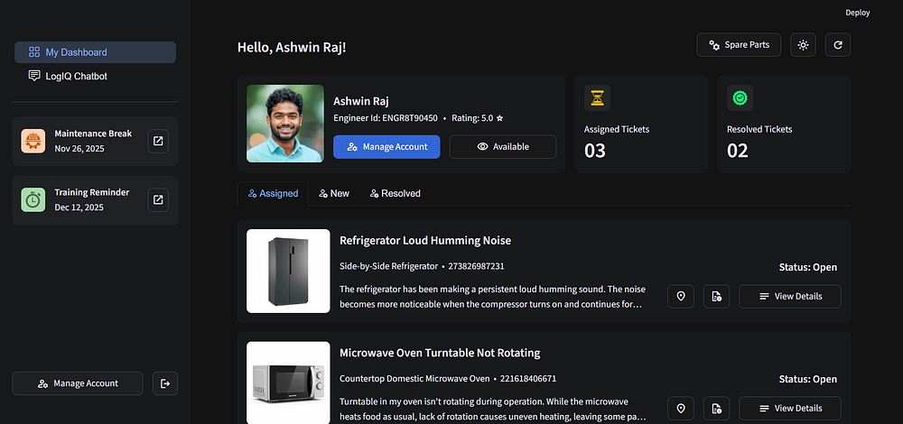
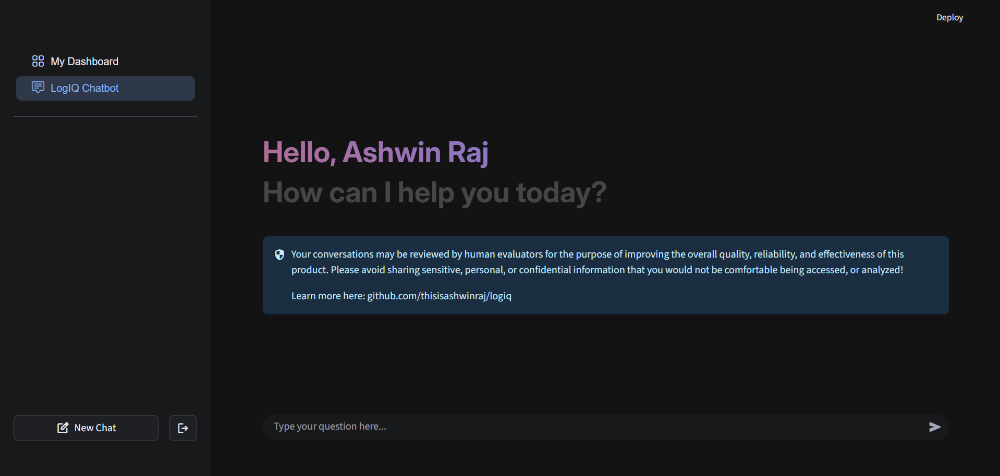
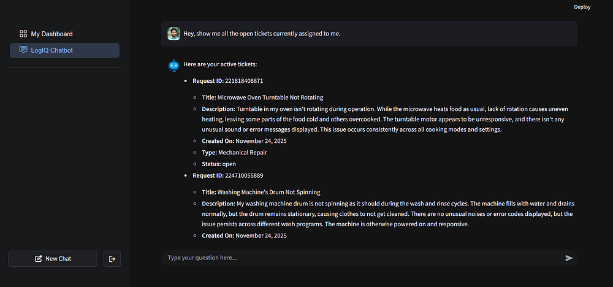
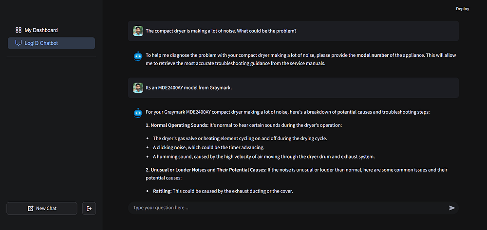
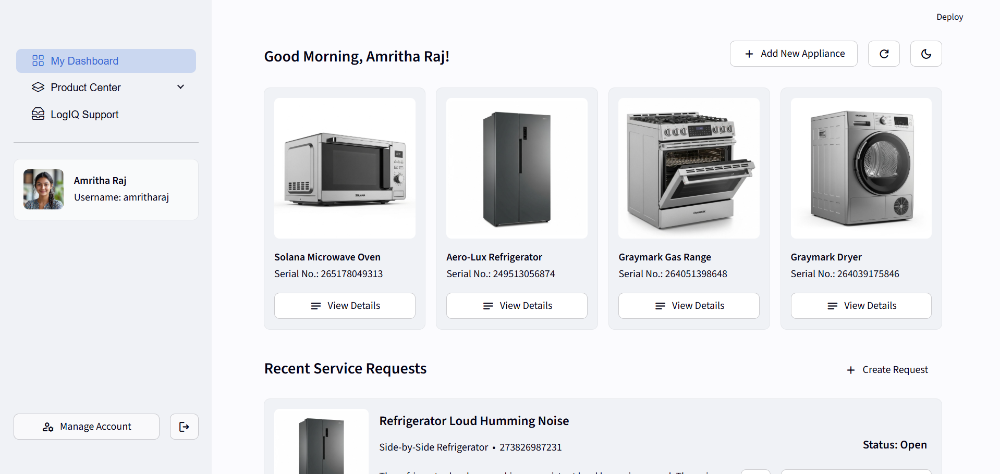
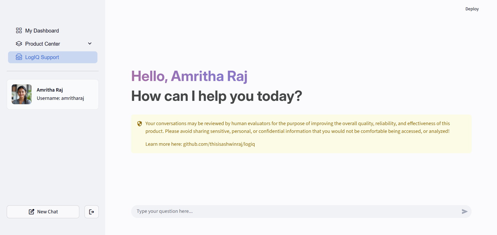
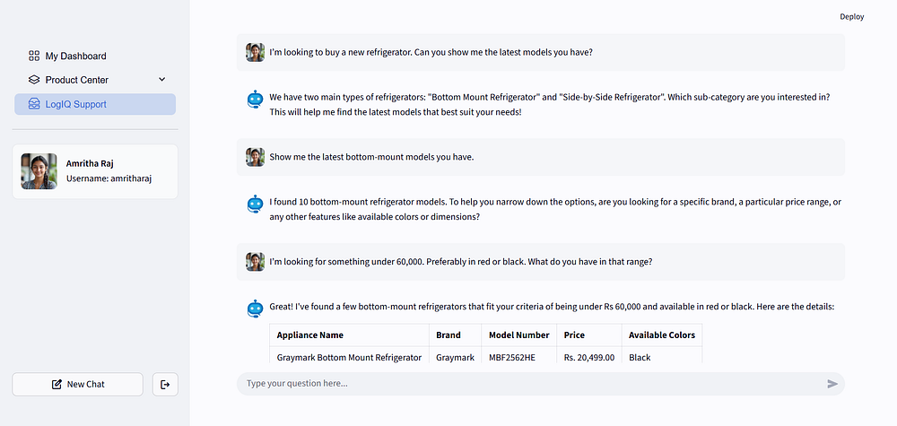
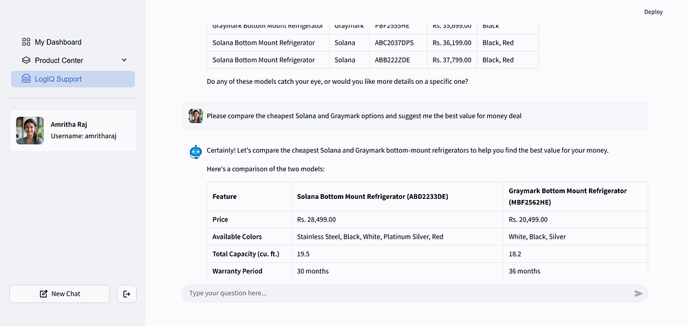

# LogIQ: Smart Home Appliance Management

<P align='justify'>Managing home appliances often involves juggling manuals, service calls and scattered records — a highly frustrating experience for many homeowners. With the rise of <B>Agentic AI</B> design framework, there's an opportunity to streamline and improve this process aptly through <B>intelligent systems</B> that can understand, guide, and act on behalf of the users</P>

<P align='justify'>This project showcases LogIQ, a smart home appliance management tool that offers an AI-powered ecosystem for customers and service engineers to manage household appliances and service bookings. The engineer application is designed to support field technicians with ticket management, navigation assistance, and AI-guided troubleshooting. Alongside this, the customer facing app enables users to manage their registered appliances, raise service requests, and access information about appliance care and maintenance. Users can interact with both the applications through the UI, or they can switch to the <B>AI Mode</B> for a guided, chat-based experience. Explore the LogIQ customers app <a href='https://logiq-customers-1017247316742.us-central1.run.app/'>here</a></P>

```diff
# Acknowledgement
# Google AI Developer Programs team supported this work by providing Google Cloud Credit
```


## Engineer App Features

- **Manage Service Requests:** View all assigned tickets, check details, and accept or reject system-assigned requests
- **Route Preview and Optimization:** Shows the optimal route and order of visit from the engineer’s current location
- **Manage Ticket Activity:** Add or update notes to ticket activity, to maintain a clear record of all actions performed
- **Access Service History:** View any past service records to understand issues and resolution before starting the job
- **Reporting:** Verify onsite visit using customer-generated OTP verification and report any unsafe working condition
- **Manage Engineer Profile:** Edit & update engineer's personal details, specializations and other profile information



### Engineer Agent

- **account_management_agent**: Manages the engineer's profile, specializations, availability, and account workflows
- **navigation_agent**: Provides real-time route preview, weather updates, and traffic guidance to the service location
- **ticket_management_agent**: Fetches assigned requests, tracks activity, updates progress and handles past records
- **troubleshoot_agent**: Assists engineer with troubleshooting guidance, common ticket patterns, repair procedures





## Customer App Features

<P align='justify'>The web app is a <B>smart home appliance management platform</B> designed to streamline and enhance how customers interact with their household devices. The app provides a clean, intuitive interface, and several key features that make appliance ownership & support effortless. Some of the key aspects of the customer application are as described here:</P>

- **Register Appliances:** Easily register new appliances with their model number, serial number, and purchase details
- **Raise Service Requests:** Log & manage service requests for registered appliances, to get onsite professional help
- **Manage Customer Profile**: Edit & update customer information, including contact details and service preferences
- **View Appliances Details:** Access centralized view of all registered appliances with warranty, specs, & support info
- **View Service Requests Status:** Track ongoing and past service requests, including live status and engineer details




### Customer Agent

- **appliance_troubleshooting_agent:** Handles complex appliance issues, and offers usersafe troubleshooting advice
- **customer_appliances_agent**: Retrieves and summarizes information about all of customer’s registered appliances
- **product_enquiry_agent:** Answers question related to the latest appliance models, features, and recommendation
- **register_appliance_agent:** Guides the customers through the process of registering an appliance to their account
- **register_onsite_service_request_agent**: Facilitates the scheduling of appliance repair and onsite maintenance visit
- **service_requests_agent:** Fetches the status and history of the user’s service requests, including engineer's activity
- **update_customer_profile_agent:** Helps update customer's profile including their name, contact details & address






## Tech Stack

1. **Cloud Infrastructure on GCP**
    - **Google Gemini:** Used across AI agents for high-quality, low-latency responses, with function calling support
    - **Imagen 4:** Used to generate photo-realistic image catalog of fictional appliances, and other in-app graphics
    - **Cloud SQL:** Stores structured data about appliances, customers, registered appliances, and engineer records
    - **Cloud Storage:** Stores graphics, invoices, warranty docs, manuals and attachments linked to service requests
    - **Firestore:** Manages realtime data for service requests, and stores appliance specifications in a NoSQL format
    - **Cloud Run:** Hosts the backend services responsible for automatically assigning engineers to service requests
    - **Google Auth Platform:** Provides secure user authentication and session management, using Google Oauth2
    - **Google Maps SDK:** Address auto-complete, validation, geocoding, and distance-based engineer assignment

2. **Frontend and Communication Services**
    - **Streamlit:** Python-based frontend with support for custom components, & CSS to enhance the user interface
    - **Twilio:** For delivering realtime SMS alert to users about service status updates, and engineer visit notification
    - **Brevo:** Sends automated transactional and notification emails—such as service confirmations, and reminders


## Data Sources

The appliance dataset used in this project is **entirely synthetic** and was generated for demonstration purposes. Brand names, descriptions, and other technical specifications were **fabricated using Gemini 2.5** to simulate realistic product metadata across various categories such as refrigerators, washers & dryers, gas ranges and microwave ovens. Such an approach allowed for consistent & scalable data creation without relying on any **proprietary** or **sensitive information**.

To visually represent these products within the application, corresponding images were generated using **Imagen 4 on Vertex AI Studio**. These images were generated to closely match the appliance specifications created in the metadata.

For implementing **Retrieval-Augmented Generation (RAG)** workflow, publicly available service manuals were sourced and preprocessed. A service manual was linked to each sub-category to demonstrate **grounded** response generation.


## Support and Feedback
Contributions are always welcome from the community. If you have any **queries** or would like to **share any feedback**, please drop a line at thisisashwinraj@gmail.com. You can also connect with me over [LinkedIn](https://www.linkedin.com/in/thisisashwinraj/) or [X (previously Twitter)](https://x.com/thisisashwinraj)
